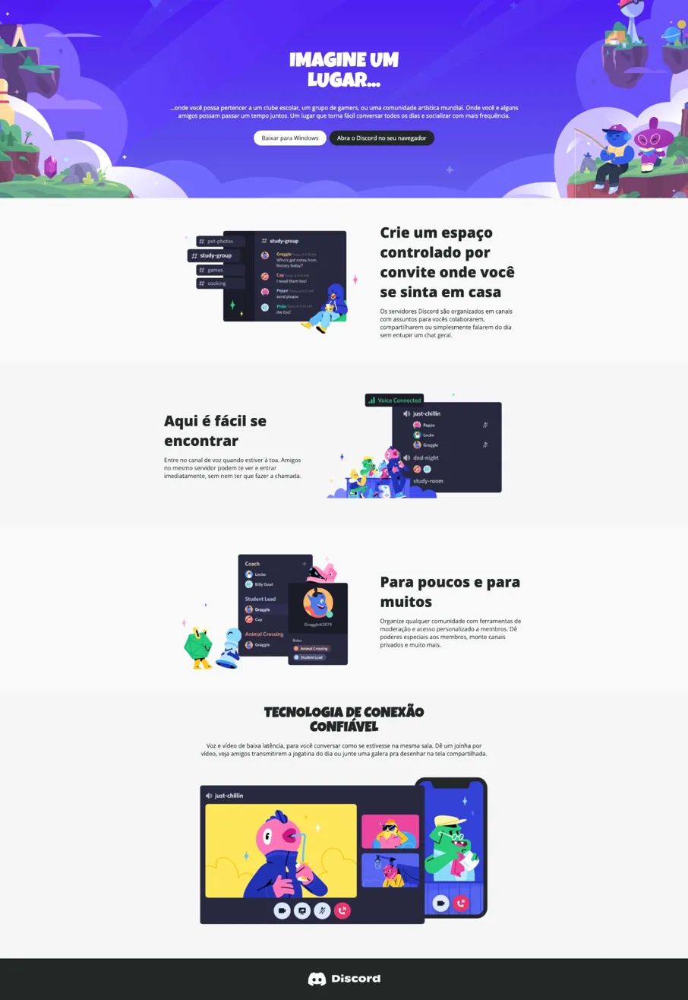
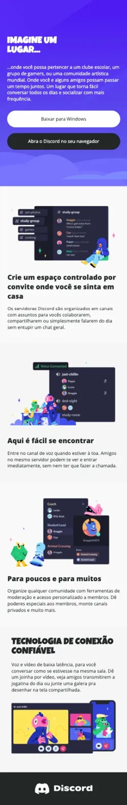

# Discord Landing Page Clone (Static Front-End)

### Intro

This project is a static front-end recreation of the Discord landing page. The goal was to reproduce the layout, typography and visual structure of the original page using only HTML5 and CSS3, focusing on clean semantic structure, component organization, responsive layout, UI accuracy and good CSS practices.

---

### Pages Implemented

- Landing page (index.html)

The page reproduces the main sections of Discord’s website, including the hero banner, feature sections, and footer.

---

### Tech Stack:

HTML5 and CSS3. No frameworks or JavaScript were used.

---

### Features:

- Layout & Structure
- Hero section with background banner
- Centered call-to-action buttons
- Multiple feature sections with images and text
- Footer with Discord branding

Responsive Design
- Mobile-first responsive adjustments
- Flexible layout using Flexbox
- Responsive images and text scaling
- Button layout adapting for smaller screens

UI & Styling
- CSS variables for color management
- Organized CSS structure by sections
- Custom fonts for hero titles
- Consistent spacing and alignment

---

### Running the Project:

This is a static project, so no build tools are required.

To run it:
1. Clone the repository;
2. Open the folder;
3. Open `index.html` in your browser.

---

### Preview:

